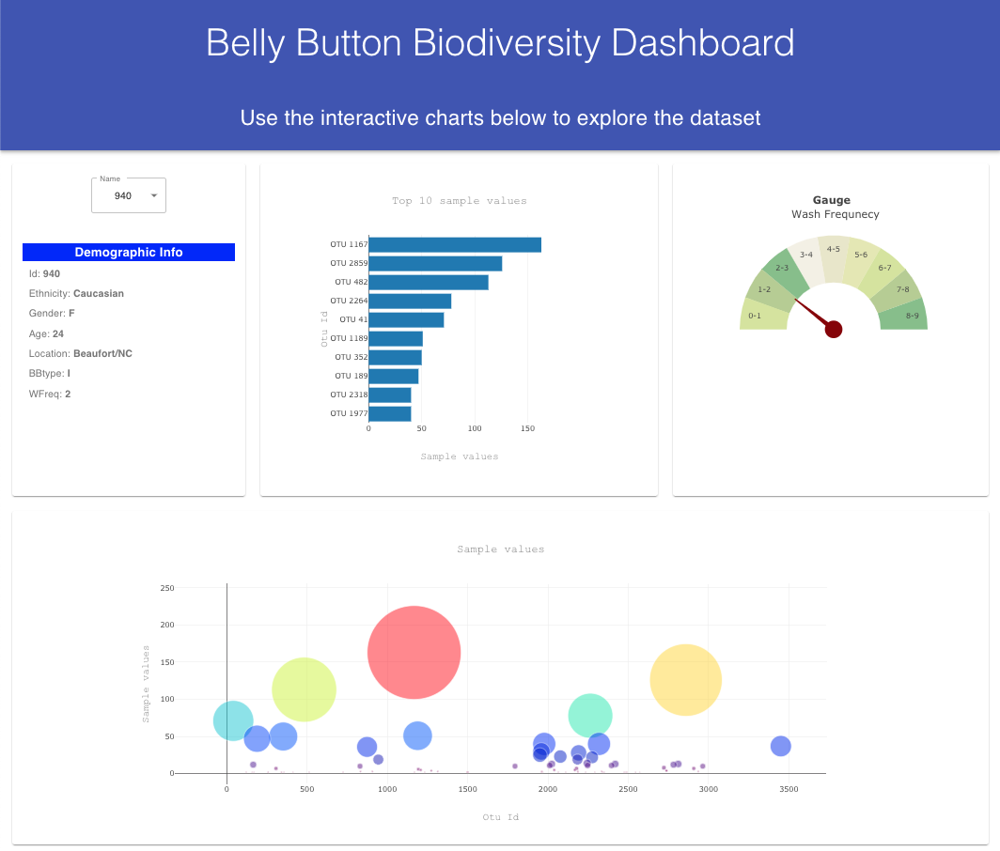

## Plotly Homework

This project was bootstrapped with [Create React App](https://github.com/facebook/create-react-app).

## Available Scripts

In the project directory, you can run:

### `yarn install`
### `yarn start`
### `yarn build`

#### Note: added 'GENERATE_SOURCEMAP=false' in '.env' file. S Source code size is large due to importing Plotly.  

